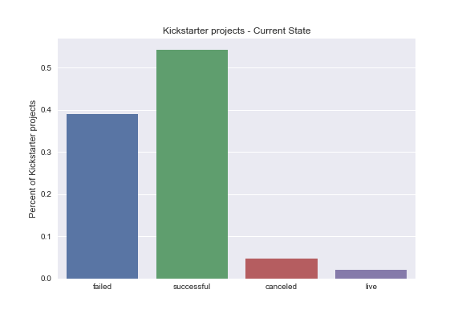
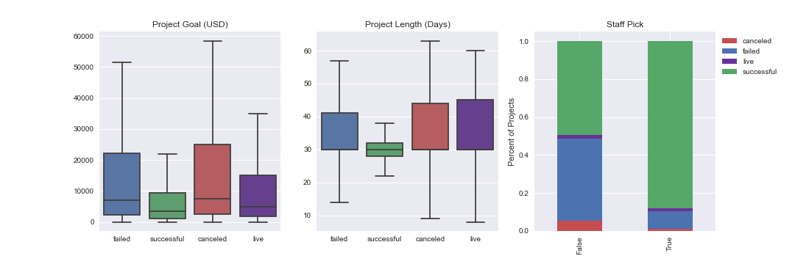
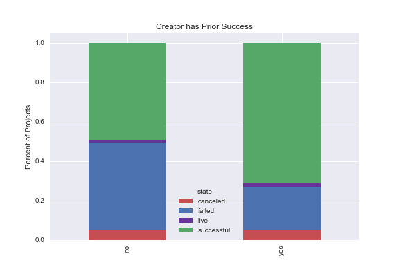
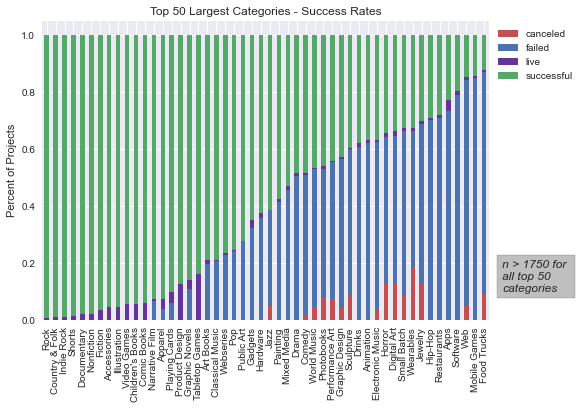

# Kickstarter: Predicting Project Success


Authors: Griffin Hundley and Mitch Krieger

## Overview

Using data webscraped from Kickstarter by WebRobots, we investigated what makes a Kickstarter project successful. We created classification models to predict the success or failure of 191,875 kickstarter projects launched between April 2009 and October 2020. Our final model was able to accurately predict success (a project is fully funded by backers) or failure of a project with 80% accuracy using only information that is would be available to creators at project launch.

## Business Problem

Kickstarter only charges backers (individuals who pledge to monetarily support a project) once a project gets fully funded. The company then takes a 5% cut of the total money raised and the rest goes to the project creators to fund the project. Therefore, it is in the best interests of both Kickstarter (generates revenue) and creators (recieves money for project) to understand what can predict whether a project will be successfully funded. 


## Data

We used a dataset from WebRobots that was generated through webscraping Kickstarter. The data contained 191,875 projects launched between Kickstarter's founding in April 2009 and October 2020. Projects covered 161 different catefories and about 55% of all projects in the dataset were succesful. Projects that were canceled behaved similarly to projects that failed, so we combined failed & canceled to create a binary classification problem. Projects that are still live were removed from the data set to predict their success or failure using our final model



## Methods

***

We wanted to create an interpretable model using only features that are known at project launch. This way, creators and kickstarter could use our model to better understand what features to concentrate on to increase a project's chance of success. We used accuracy and f1 scores to evaluate models from various algorithms. We choose f1 because we wanted to balance recall and precision so that we both encourage creators to kickstart their projects (minimizing false negatives) but also be clear about what kinds of projects are going to succeed (minimizing false positives).

## Results

***

After running Random Forset, XGBoost, and Logistic Regression models, we chose Logistic Regression for to maximize interpretability and because it had similarly high accuracy and f1 scores to other models. 

Our model was able to predict success or failure of a project with about 80% accuracy and an f1 score of .8. ROCAUC?

## Conculsion

***

In general, successful projects clearly had features distinct from failed projects. Successful projects tended to:

- Set a goal deadline of ~ 30 days
- Set reasonable funding goal (< \$20,000)
- Recieved a "Staff Pick by Kickstarter Staff



Creators with another success had successful projects more often than first-time creators.



There were also distinct differences in success rates between the different categories, clearly revealed by the 50 largest categories:



## Next Steps

***

For further project development, we would incorporate backer rewards into the model. The number of rewards available to backers, the monetary levels of those rewards and the quality of rewards may all contibriute to whether or not a backers will pledge. In addition, how success rates have varied over time may be useful information for both Kickstarter and future backers. Finally, an analysis of how our model does on other crowdfunding platforms like Indiegogo and GoFundMe, may help reveal what project do best on kickstater vs elsewhere.

## Repository Structure

***

```
├── README.md                           <- The high-level overview of this project
├── presentation.pdf                    <- PDF version of project presentation
├── data                                <- compiled csv file of sourced data, and compressed version
├── images                              <- Sourced externally and visualizations generated from code
├── notebooks                           <- All notebooks used in this project, including the Final_Notebook
│   └── scratch_notebooks               <- Notebooks used for experimentation
├── 
└── src                                 <- Code files referenced in project
```